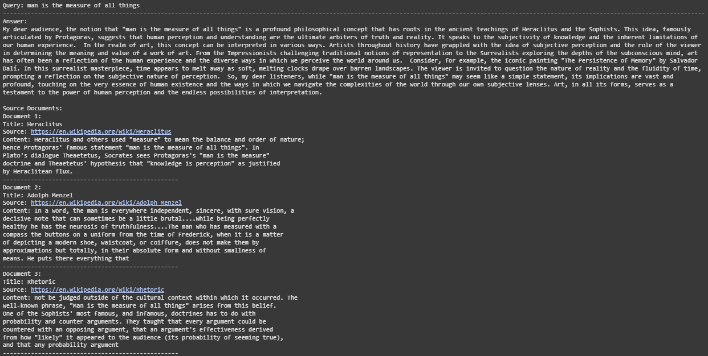

# Art-RAG-Chatbot
A Langchain RAG-LLM Bot, using a ChromaDB created from Wikipedia Articles about Art. All in a nice gradio packaging.

### This project was done as practice in the use of VectorDBs, Langchain, Retrieval-Augmented-Generation(RAG) and different LLM APIs. 

## The project can be analysed in 3 different steps.
### Step1: Using WikipediaAPI to crawl automatically to create a document. An Information Corpus from where we can pull requests. (wikipedia_art_corpus_document)

### Step2: Load, Split, vectorise the document into a Choma Vector Database (document_to_vectordb)

### Step3: Use a retreiver and and a LLM to provide natural, accurate and informed answers (art_claude_rag). Take it a step further by changing the LLm and create a simple Gradio App. (art_GPT_gradio_implementation)

##### *Because Github is a bit silly i only could provide the code but not the prints. Below you can find some example that i saved by hand.
##### *Besides that both the Wikipedia Document JSON and the Vector Database zip were too big to load ¯\_(ツ)_/¯
##### *Also i added a separate .txt file that describes the problems found and how I tackled them. (challenges.txt)

## Here is the query using the VectorDB without a informed retreiver.

### Here is the RAG results for questioning about Stained glass
#### With Claude

#### With GPT-3.5 Turbo

### Here is the RAG results for questioning about the Legacy of Donatello
#### With Claude

#### With GPT-3.5 Turbo

### The RAG results for questioning about the phrace "the man is the measure of all things"
#### With Claude

#### With GPT-3.5 Turbo

## The barebone Gradio App looked like this

## But by adding an AI Image Generator the final results is much more impressive 

## As the results prove the RAG can effectivelly draw uppon speciallised knowledge using the Langchain retreiver from the Vectorised Knowledge Database while providing funny human looking responses as set by the prompt. Also it filters anything that the database does not know avoiding any hallucinations or drawing from the LLM prior knowlegde. 

